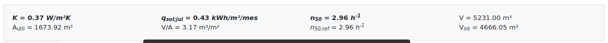
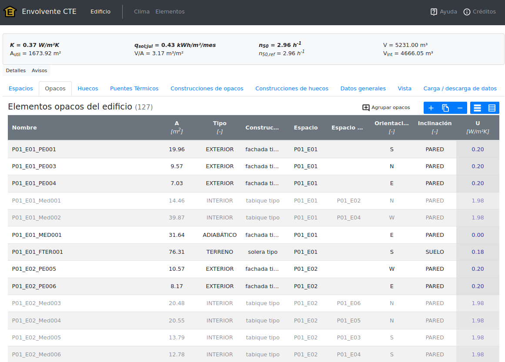
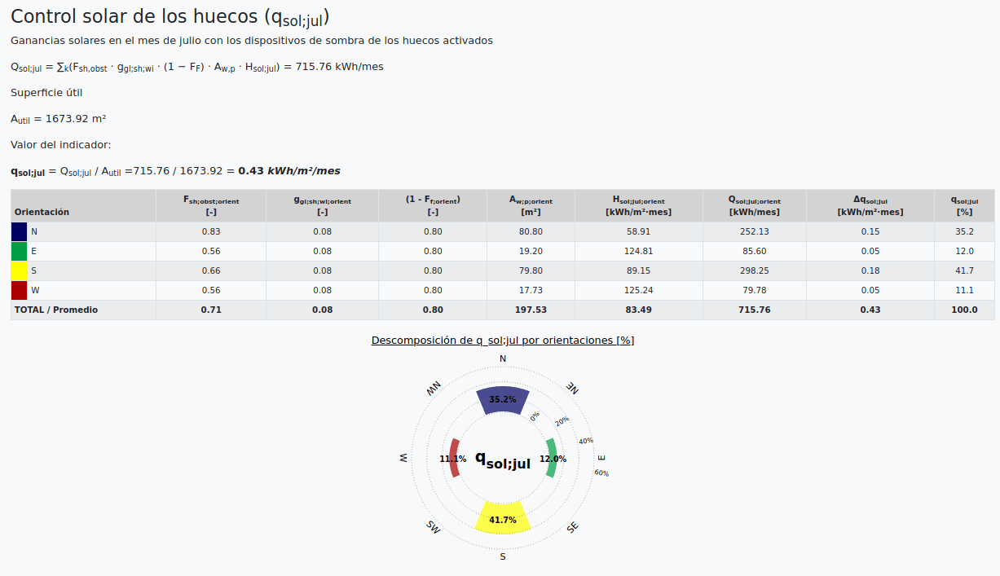
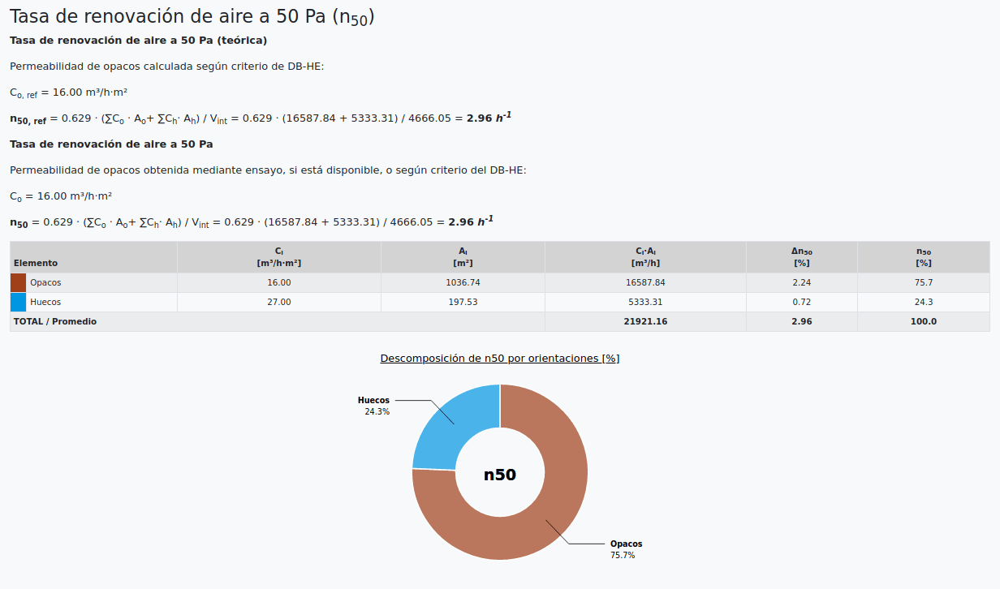
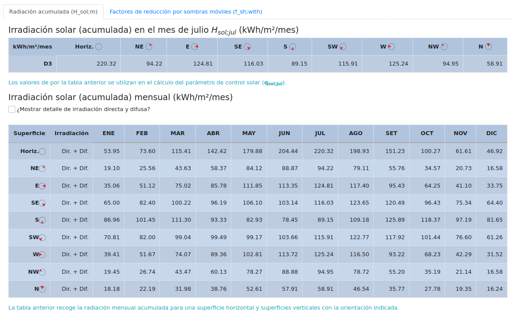
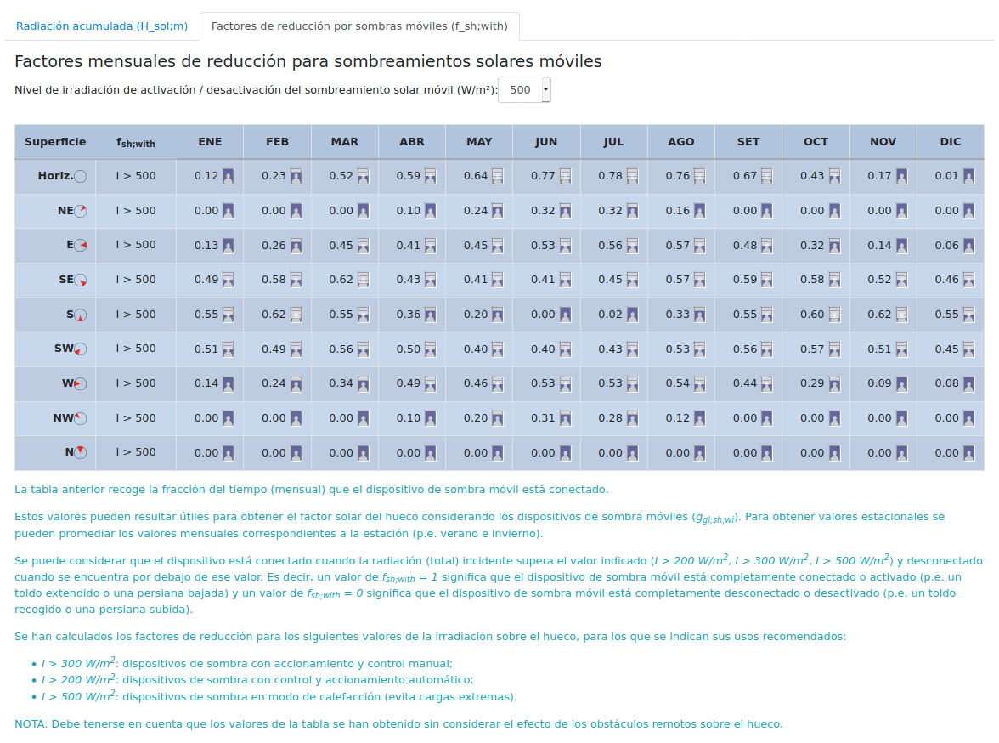
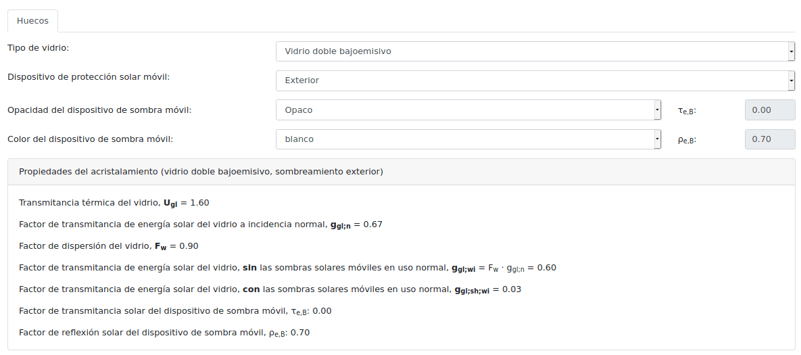

# Indicadores de envolvente térmica para la aplicación del CTE DB-HE

[`EnvolventeCTE`](http://pachi.github.io/envolventecte) es una aplicación web de ayuda al cálculo de indicadores y parámetros de eficiencia energética de la envolvente térmica.

[`EnvolventeCTE`](http://pachi.github.io/envolventecte) es software libre, y se distribuye bajo las condiciones de la [licencia MIT](./LICENSE.txt). Ha sido desarrollada por el equipo de energía del [_Instituto Eduardo Torroja de Ciencias de la Construcción (IETcc-CSIC)_](https://www.ietcc.csic.es):

- Rafael Villar Burke
- Daniel Jiménez González
- Marta Sorribes Gil

## Funcionamiento del programa

[`EnvolventeCTE` está disponible online pulsando este enlace](http://pachi.github.io/envolventecte). Es necesario el uso de un navegador reciente y se recomienda el uso de [Mozilla Firefox](https://www.mozilla.org/es-ES/firefox/new/) para máxima compatibilidad.

A partir de una descripción de la envolvente (de sus parámetros energéticos básicos) y la zona climática del edificio (datos generales), la aplicación calcula diversos indicadores de eficiencia energética de la envolvente térmica, entre ellos los definidos en el CTE DB-HE (2019):

- **Transmitancia de los elementos de la envolvente térmica**, (**U**);
- **Transmitancia térmica global** (**K**);
- **Control solar** (**qsol;jul**);
- **Relación de cambio de aire a 50 Pa** (**n50**).

E indicadores generales como:

- Superficie útil de los espacios habitables interiores a la envolvente (Autil);
- Compacidad (V/A);
- Volumen de la envolvente térmica (V);
- Volumen neto de la envolvente térmica (Vint).

También permite consultar otros parámetros relacionados con la radiación solar de superficies inclinadas y orientadas, como la **irradiación solar acumulada mensual**, el **factor de reducción para sombreamientos solares móviles** o el **factor solar de los huecos teniendo en cuenta las sombreamientos solares móviles**.

Además, facilita el cálculo de elementos de la envolvente y sus parámetros energéticos como:

- Propiedades del acristalamiento (Ugl, ggl;wi, ggl;sh;wi) a partir del tipo de acristalamiento, marco y protecciones solares

## Definición de la envolvente térmica

La aplicación permite describir la envolvente térmica a partir de sus componentes (huecos, opacos y puentes térmicos) y los espacios del edificio, y realiza el cálculo de los indicadores de calidad en la envolvente térmica definidos en el CTE DB-HE.

Para los elementos de los que dispone suficientes datos calcula su transmitancia térmica e indica, mediante un color más tenue cuáles están excluidos de la envolvente térmica.

Todos los datos son fácilmente editables haciendo doble click sobre la celda correspondiente.

Para la introducción de datos puede también importar archivos `.ctehexml` de la _Herramienta Unificada LIDER/CALENER (HULC)_, arrastrándolo en el área de importación de datos de la pestaña de carga y descarga de datos.

En ese mismo apartado puede descargar el modelo introducido, y sus modificaciones, en formato `JSON`, pudiéndolo volver a cargar en otro momento.

## Obtención de indicadores

Al introducir o modificar datos del edificio, la aplicación actualiza en tiempo real los indicadores de eficiencia y, en el apartado de `Detalles`, se puede consultar un informe sobre la composición de los mismos, como ayuda al diagnóstico y diseño.

- La **transmitancia térmica global** (**K**) se basa en el coeficiente global de transmisión de calor (**Htr,adj**, apartado 8.3.1, ec. 17 de la _UNE EN ISO 13790:2008_ y apartado 6.6.5.2, ec. 108 de la _ISO/FDIS 52016-1_) repercutido por la superficie de intercambio con el exterior.  Mide la capacidad global de evitar el intercambio de calor por conducción.

    

- El parámetro de **control solar** (**qsol;jul**) se basa en el flujo de calor por ganancias solares, _Φsol;k_, (apartado 11.3.2, ec. 43 de la _UNE EN ISO 13790:2008_ y apartado 6.5.13.2, ec. 69 de la _ISO/FDIS 52016-1_), despreciando la reirradiación al cielo, repercutido por la superficie útil considerada y considerando activadas las protecciones solares móviles.  Mide la posibilidad de controlar las ganancias solares (incluyendo el uso de dispositivos solares móviles y el efecto de otros obstáculos fijos o remotos).

    

- La **relación de cambio de aire a 50 Pa** (**n50**) evalúa la permeabilidad de la envolvente al paso del aire, considerando una diferencia de presiones entre el interior y el exterior de 50 Pa. El programa realiza el cálculo del valor teórico de referencia del CTE DB-HE de acuerdo al Anejo H (determinación teórica o en base a ensayo de la norma _UNE EN ISO 13829:2002_).  Mide la permeabilidad al aire y, por tanto, se relaciona con el intercambio de calor por infiltración o exfiltración de aire.

    

## Datos relacionados con el clima

La aplicación calcula, para superficies inclinadas y orientadas, valores de los siguientes parámetros:

- **Irradiación acumulada mensual** (**Hsol;m**);
- **irradiación acumulada en el mes de julio** (**Hsol;jul**);
- **Factor de reducción para sombreamientos solares móviles** (**fsh;with**).

Los cálculos para las distintas orientaciones y climas usan valores obtenidos a partir de los archivos climáticos de referencia del _CTE DB-HE_, disponibles en [este enlace](http://www.codigotecnico.org/images/stories/pdf/ahorroEnergia/CTEdatosMET_20140418.zip), y el procedimiento de la norma _ISO/FDIS 52010‐1:2016_.

## Elementos de la envolvente térmica

La aplicación permite obtener algunos parámetros descriptivos del comportamiento térmico de elementos de la envolvente térmica a partir de sus características generales o parámetros de diseño.

Por ejemplo, para los huecos se puede obtener: la transmitancia térmica (U), el factor solar del vidrio a incidencia normal (ggl;n), el factor solar del hueco (ggl;wi), el factor solar del hueco teniendo en cuenta los sombreamientos solares móviles (ggl;sh;wi).

## Limitaciones del programa

- los volúmenes de los espacios se calculan como producto de la superficie del espacio y de su altura, independientemente de la configuración geométrica de sus cerramientos
- los huecos solamente pueden definirse de forma rectangular
- la resistencia y profundidad del aislamiento perimetral de soleras son únicos para todo el proyecto

### Importación de archivos HULC

- no se importan las lamas (horizontales o verticales) definidas en los huecos
- no se importan muros definidos con puntos 3D
- el factor de sombras remotas de los huecos debe importarse de forma separada, usando el archivo KyGananciasSolares.txt

## Licencia

Esta aplicación es software libre y se distribuye bajo las condiciones de la licencia MIT. Vea el archivo LICENSE.txt para el texto de la licencia completo.
